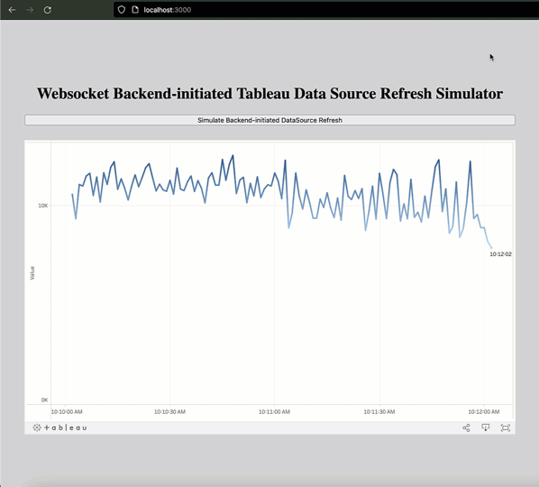

# Websocket Tableau Data Source Refresh

This project demonstrates how to initiate a Tableau data source refresh from the backend via WebSockets, allowing real-time updates in a frontend application with the Tableau Embedded Dashboard.

E.g. when a users submits new data/params using some sort of backend process and once the underpinning database completes saving this data, the corresponding changes need to be reflected in the frontend.

 
<!-- Consider adding a screenshot of your project for a visual representation -->

## Prerequisites

- [Node.js](https://nodejs.org/) installed.
- A running Tableau Server or Tableau Public visualization that you'd like to embed and refresh.

## Installation

1. **Clone the repository**:
   
git clone https://github.com/Tab-SE/tab_backend_ds_refresh_websocket.git

2. **Navigate to the project directory**:

cd YOUR_REPOSITORY_NAME

3. **Install the necessary dependencies**:

npm install

4. **Start the server** (you may need to adjust this based on your server script name and setup):

node server.js

## Usage

1. Open a browser and navigate to `http://localhost:3000`.
2. Click the "Simulate Backend Refresh" button to simulate a backend-initiated call to refresh the Tableau data source.
3. A message will be displayed with the time the data source was last refreshed.

## Contributing

Pull requests are welcome. For major changes, please open an issue first to discuss what you would like to change.

## Docs

- [Tableau Embedding API v3](https://help.tableau.com/current/api/embedding_api/en-us/index.html)

